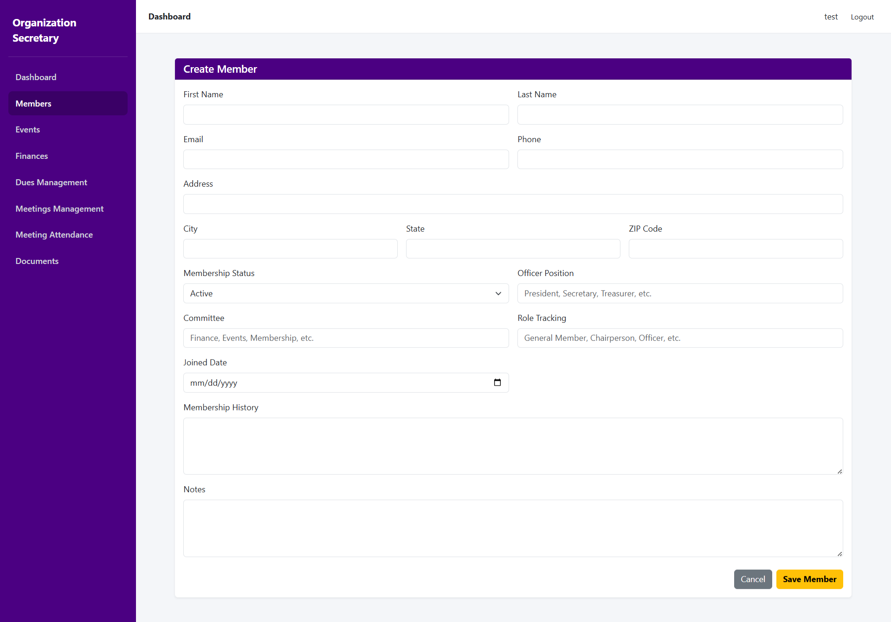
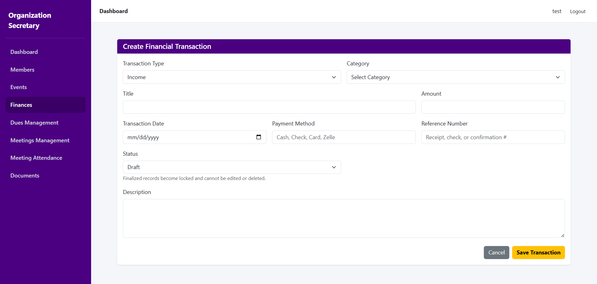
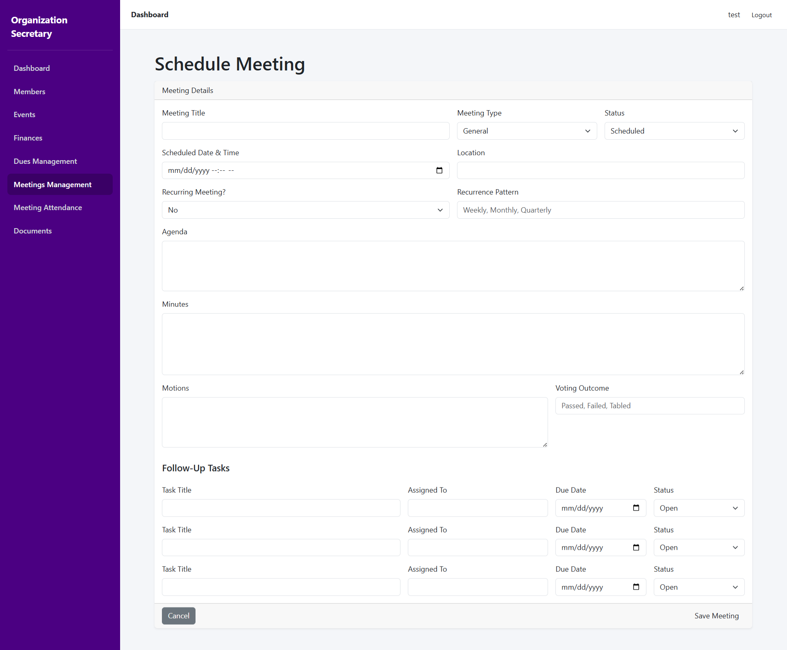
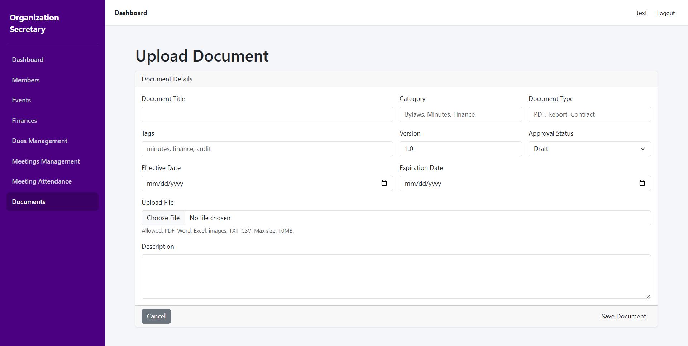

# KRS System Project Platform

A modern full-stack organization management platform built using Laravel 13, MySQL, Bootstrap 5, and Blade templates.

---

#  KRS System Project Platform

## Overview

The KRS System Project Platform is a comprehensive web application designed to streamline the administrative operations of fraternities, nonprofits, clubs, associations, and civic organizations.

The platform centralizes:

* Membership management
* Meeting coordination
* Attendance tracking
* Financial record keeping
* Committee management
* Document storage
* Officer reporting
* Event planning
* Internal communications

This application solves the common problem of fragmented organizational administration by replacing spreadsheets, paper records, disconnected email chains, and manual processes with a unified digital platform.

The system was architected with scalability, maintainability, and operational accountability in mind using modern Laravel development practices.

---

## Business Problem Solved

Many organizations struggle with:

* Disorganized member records
* Missing meeting documentation
* Poor financial accountability
* Manual attendance tracking
* Scattered document storage
* Limited reporting visibility
* Lack of centralized administration tools

This platform solves these problems through:

* Centralized organizational data management
* Immutable financial transaction tracking
* Automated attendance logging
* Structured meeting documentation
* Role-ready modular architecture
* Searchable document repositories
* Audit-friendly operational workflows

---

## Features

```md
- Multi-tenant organization architecture
- Membership management
- Officer and committee tracking
- Meeting scheduling and agenda management
- Attendance management
- Financial ledger system
- Treasurer reporting
- Event management
- Document storage and archives
- Real-time dashboard analytics
- Bootstrap 5 responsive UI
- Queue-based notification system
- RESTful API architecture
- Secure authentication
- Activity and audit logging
- Mobile-friendly administrative interface
```

---

## Tech Stack

```md
Backend
-------
Laravel 13
PHP 8.4
MySQL
Eloquent ORM
Laravel Queues
Laravel Scheduler

Frontend
--------
Blade Templates
Bootstrap 5
Vanilla JavaScript

Infrastructure
--------------
Apache
Redis
Supervisor
Ubuntu Linux

Development Tools
-----------------
Git
GitHub
Composer
NPM
Vite
```

---

# Screenshots

## Members Module



## Financial Ledger



## Meeting Management



## Documents Tracking



---

# Architecture Diagrams

## Laravel Service Layer


### Service Layer Overview

The application follows a service-oriented Laravel architecture.

```text
Controllers
    ↓
Service Classes
    ↓
Repositories
    ↓
Eloquent Models
    ↓
Database
```

Examples:

* MemberService
* FinanceService
* AttendanceService
* MeetingService
* EventService
* DocumentService

This architecture keeps controllers thin while promoting:

* Maintainability
* Testability
* Reusability
* Separation of concerns

---

## Queue System


### Queue Architecture

```text
User Action
    ↓
Dispatch Job
    ↓
Redis Queue
    ↓
Laravel Worker
    ↓
Email / Notification / Report Processing
```

Queues are used for:

* Email notifications
* Report generation
* Attendance exports
* Financial exports
* Scheduled reminders
* Event notifications

Benefits:

* Faster UI responsiveness
* Scalable background processing
* Improved system reliability

---

## Database ERD


### Core Database Relationships

```text
Organizations
    ├── Members
    ├── Meetings
    ├── Attendance
    ├── FinancialTransactions
    ├── Events
    ├── Documents
    ├── Committees
    └── OfficerPositions
```

Key Design Principles:

* Relational normalization
* Foreign key integrity
* Immutable financial records
* Audit-friendly transaction logging
* Scalable modular schema

---

# Installation

## Clone Repository

```bash
git clone https://github.com/KJordan1225/krs-system-proj.git
```

---

## Navigate Into Project

```bash
cd krs-system-proj
```

---

## Install Dependencies

```bash
composer install

npm install
```

---

## Configure Environment

```bash
cp .env.example .env
```

Update database credentials in `.env`.

---

## Generate Application Key

```bash
php artisan key:generate
```

---

## Run Migrations

```bash
php artisan migrate
```

---

## Create Storage Link

```bash
php artisan storage:link
```

---

## Build Frontend Assets

```bash
npm run build
```

---

## Start Development Server

```bash
php artisan serve
```

---

## Database Design

The schema was designed using:

* Normalized relational modeling
* Organization-scoped data
* Immutable ledger transactions
* Soft deletes where appropriate
* Optimized indexing

---

# Security Features

```md
- CSRF protection
- Password hashing
- Authentication middleware
- Validation layers
- Secure file uploads
- Route protection
- Tenant data isolation
```

---

# Future Enhancements

```md
- Mobile application
- Real-time chat
- SMS notifications
- AI-powered reporting
- Stripe payment integration
- Event ticketing
- Public organization portals
- Calendar synchronization
```

---

# Developer Notes

This project demonstrates:

* Enterprise Laravel architecture
* Modular application design
* Queue-based scaling
* Service-layer engineering
* Database modeling
* REST API implementation
* Multi-tenant SaaS concepts

The application was intentionally structured to reflect senior-level software engineering practices suitable for scalable organizational platforms.

---

# License

MIT License

---

# Author

Keith Jordan

Full Stack Web Applications Engineer
Laravel | PHP | MySQL | Bootstrap | Vue | API Development
